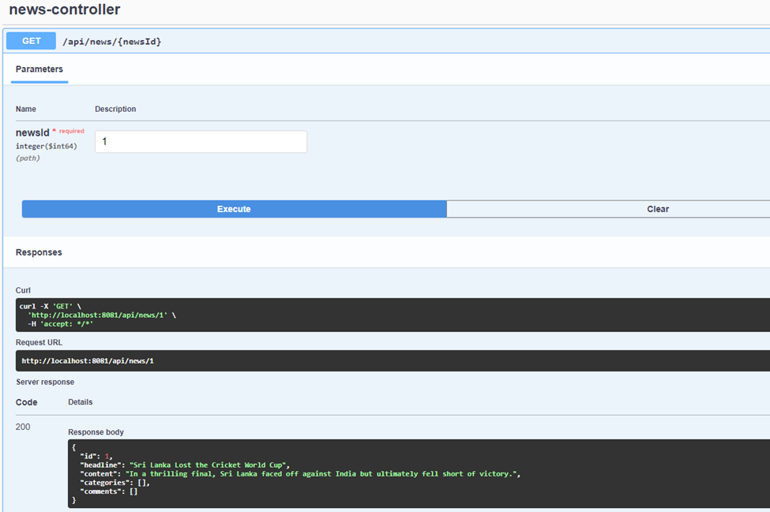

# spSolutiontest

solutions to first five question can be seen in following folder >>

following is the swagger for practical assignment

note that i have used postgresql instead of mysql

http://localhost:8081/swagger-ui/index.html#

